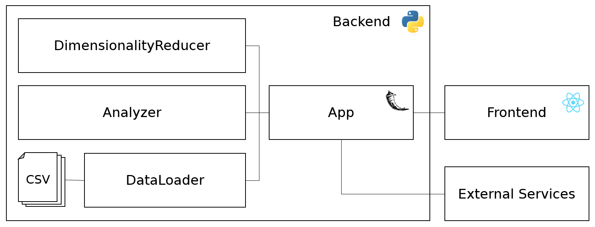

# Short Documentation

This is a short documentation of the Okoa app that was developed in the 2017 master's project at the EPIC chair at HPI. The current version is deployed at [http://vm-mpws2017hp1.eaalab.hpi.uni-potsdam.de](http://vm-mpws2017hp1.eaalab.hpi.uni-potsdam.de).

1.  [Infrastructure](#infrastructure)
    * [Restart the Server](#server-restart)
    * [Deployment](#deployment)
    * [Local Setup](#local-setup)
2.  [Data](#data)
    * [Parsing](#parsing)
    * [Adding Data](#adding-data)
3.  [App](#app)

    * [Backend](#backend)
    * [Frontend](#frontend)
    * [Analyzing the Data](#analyzing-data)
    * [Suggestions and Learnings](#suggestions-learnings)

<a name="infrastructure"/>

## Infrastructure

The Okoa app is deployed on a Ubuntu 16.04.3 LTS virtual machine. From the HPI network it is accessible via `vm-mpws2017hp1.eaalab.hpi.uni-potsdam.de`.

<a name="server-restart"/>

### Restart the Server

To restart the server, connect via `ssh` and manually run the git commit hook.

```
ssh deploy@vm-mpws2017hp1.eaalab.hpi.uni-potsdam.de
cd /var/mp-server-repo
./hooks/post-receive
```

The server is started on boot, configured at `crontab -u deploy -e`. 

<a name="deployment"/>

### Deployment

To deploy, add the git remote if not already done:

```
git remote add server-deploy deploy@vm-mpws2017hp1.eaalab.hpi.uni-potsdam.de:/var/mp-server-repo
```

Then you can push new versions to the remote that automatically are deployed:

```
git push server-deploy
```

We are using a git remote on our deployment server (for instructions go [here](https://gist.github.com/noelboss/3fe13927025b89757f8fb12e9066f2fa)) that runs an install and start script via the post-receive hook. The hook can be found in `scripts/git_hook_post-receive`. Make sure the hook on the server is executable with `chmod a+x post-receive`.

We also redirect port `8080` where our app is running on to the default port `80`. (Due to required permissions for ports < 1024; set in `/etc/network/interfaces`)

<a name="local-setup"/>

### Local Setup

We tested our setup with x64, Python 3.5.3, Pip 9.0.1, Node 9.4.0, and NPM 5.6.0.

#### Flask Server

To start the Flask server you need to install all requirements by running:

```
pip install -r requirements.txt
```

Then you can start the server by:

```
python app.py
```

The server should restart when file changes are detected. Also it does not die on errors and displays the error message in the browser.

#### Node Server

Go to the client directory and install dependencies:

```
cd client && npm install
```

To only start the Node server, run:

```
npm run start-client
```

To start the Flask and the Node server concurrently, just run:

```
npm start
```

This is also done by the `./start.sh` script in the root directory for lazy developers who don't want to change directories so much.

<a name="data"/>

## Data

The data is not part of this repository. It must be stored inside a manually created data folder.
Each dataset is inside its own folder called `dataset<1|2|3>`.
They can be downloaded and parsed into subsets by running:

```
python scripts/download_data.py
```

Inside each folder is a data and meta data file and a folder for subsets which contain `.npy` files for each cancer type.

<a name="parsing"/>

### Parsing

```diff
- TODO: (short) wo ist das Modul, was macht es grob
```

<a name="adding-data"/>

### Adding Data

```diff
- TODO: kurz halten, wo muss man nachgucken, worauf muss man achten?
```

<a name="app"/>

## App

```diff
- TODO: short intro
```



<a name="backend"/>

### Backend

The backend routes are defined in the app.py which can be found in the top-level of the repo. It is also responsible for loading the data and running the server. We moved some logic from the app.py into the server folder. Furthermore, a cache implementation can be found in the utils folder.

The logic for data preparation as well as for feature selection can be found in the utils folder. It contains classes for loading, normalizing and sampling data. The data can be analyzed with the Dimensionality Reducer in the next step. It implements most of our feature selection approaches and contains utility functions to enable One-vs-Rest feature selection and the return of multiple feature subsets.
The EA implementation has its own folder where you can also find the fitness functions.
The utils folder also contains the implementation of the reliefF algorithm from the scikit-feature repository. (https://github.com/jundongl/scikit-feature)

The evaluation of feature subsets can be found in the validation folder. The Analyzer is responsible for computing fitness scores for a given feature subset, for computing the expression matrix and for providing utility functions as in the Dimensionality Reducer.

Jupyter files (e.g. classification.py) to explore and test the functionalities can be found in the top-level.

<a name="frontend"/>

### Frontend

```diff
- TODO: Short intro (Redux); Shortly describe folder structure, where to find what?
```

<a name="analyzing-data"/>

### Analyzing the Data

We decided to use IDE extensions for exploration and visualization.
This comes with the advantage of auto-completion, linting and a better version control in comparison with Jupyter notebooks.

* Atom: Hydrogen
* VS Code: Jupyter, Python
* Sublime: Jupyter

We decided to put files for exploration (dimensionality reduction, feature selection, plotting etc.) in the root folder.
Each script can load specific data with the help of the DataLoader class from the utils folder.

To get the Jupyter feeling inside the exploration files, you need to add breakpoints to the code by adding `#%%`.
This will create cells which can be executed independently after each other. Variables are stored in a session and can be explored and visualized inside the IDE.

<a name="suggestions-learnings"/>

### Suggestions and Learnings

* DataLoader should be initialized only once as it reads all the data files into memory

* When modifying modules which are imported in the exploration scripts, you need to restart the kernel before the changes get active. A new import does not help here
